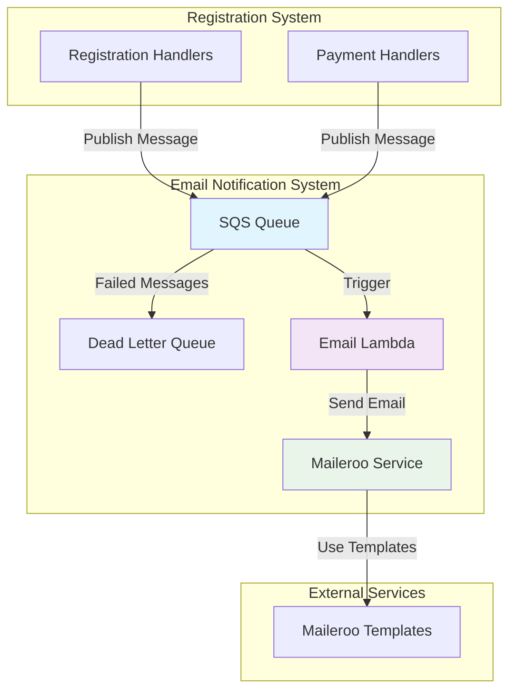

# Email Notification System Design

## Overview

The Email Notification System is a serverless, event-driven architecture that sends automated emails to participants when specific events occur in the registration system. The system leverages AWS SQS for asynchronous message processing and the Maileroo SDK for reliable email delivery using templated emails with dynamic content.

The system integrates seamlessly with the existing event registration infrastructure, following the established patterns for stage-aware resource naming, Lambda function architecture, and error handling.

## Architecture

### High-Level Architecture



### Message Flow

1. **Registration Success**: Registration handlers publish email notification messages to SQS
2. **Payment Update**: Payment handlers publish payment confirmation messages to SQS
3. **Message Processing**: Email Lambda processes SQS messages and sends emails via Maileroo
4. **Error Handling**: Failed messages are sent to Dead Letter Queue for manual review

## Components and Interfaces

### 1. SQS Queue Infrastructure

#### Email Notification Queue
- **Purpose**: Primary queue for email notification messages
- **Naming**: `{stage}-{project}-email-notifications`
- **Configuration**:
  - Visibility timeout: 60 seconds
  - Message retention: 14 days
  - Dead letter queue after 3 failed attempts
  - FIFO: false (standard queue for better throughput)

#### Dead Letter Queue
- **Purpose**: Store failed email messages for manual review
- **Naming**: `{stage}-{project}-email-notifications-dlq`
- **Configuration**:
  - Message retention: 14 days
  - No redrive policy (terminal queue)

### 2. Lambda Functions

#### Email Processor Lambda
- **Purpose**: Process SQS messages and send emails via Maileroo
- **Naming**: `{stage}-{project}-email-processor`
- **Runtime**: Node.js 22.x
- **Memory**: 512 MB
- **Timeout**: 60 seconds
- **Concurrency**: 10 (to avoid overwhelming Maileroo API)
- **Environment Variables**:
  - `MAILEROO_API_KEY`: API key for Maileroo service
  - `INDIVIDUAL_TEMPLATE_ID`: Template ID for individual registrations
  - `TEAM_TEMPLATE_ID`: Template ID for team registrations
  - `CONFIRMATION_TEMPLATE_ID`: Template ID for payment confirmations
  - `FROM_EMAIL`: Sender email address
  - `FROM_NAME`: Sender display name

### 3. Maileroo Integration

#### Client Configuration
```typescript
import { MailerooClient, EmailAddress } from "maileroo-sdk";

const client = new MailerooClient(process.env.MAILEROO_API_KEY);
```

#### Email Sending Interface
```typescript
interface EmailRequest {
  to: EmailAddress;
  subject: string;
  templateId: number;
  templateData: Record<string, any>;
}

const referenceId = await client.sendTemplatedEmail({
  from: new EmailAddress(process.env.FROM_EMAIL, process.env.FROM_NAME),
  to: emailRequest.to,
  subject: emailRequest.subject,
  template_id: emailRequest.templateId,
  template_data: emailRequest.templateData
});
```

### 4. Message Schemas

#### Registration Notification Message
```typescript
interface RegistrationNotificationMessage {
  type: 'registration_success';
  registrationType: 'individual' | 'team';
  eventId: string;
  reservationId: string;
  participant: {
    email: string;
    firstName: string;
    lastName: string;
    participantId?: string; // For individual
  };
  team?: {
    name: string;
    members: Array<{
      name: string;
      email: string;
      role?: string;
      isCaptain: boolean;
    }>;
  };
  event: {
    name: string;
    date: string;
    time: string;
    location: string;
  };
  payment: {
    amount: string;
    bankAccount: string;
  };
}
```

#### Payment Confirmation Message
```typescript
interface PaymentConfirmationMessage {
  type: 'payment_confirmed';
  reservationId: string;
  participant: {
    email: string;
    firstName: string;
    lastName: string;
    participantId: string;
  };
  event: {
    name: string;
    date: string;
    time: string;
    location: string;
  };
  payment: {
    amount: string;
    confirmationNumber: string;
    transferReference: string;
    paymentDate: string;
  };
}
```

### 5. Template Data Mapping

#### Individual Registration Template Data
```typescript
interface IndividualTemplateData {
  event_name: string;
  event_date: string;
  event_time: string;
  event_location: string;
  participant_id: string;
  participant_name: string;
  payment_amount: string;
  bank_account: string;
  reservation_id: string;
}
```

#### Team Registration Template Data
```typescript
interface TeamTemplateData {
  event_name: string;
  event_date: string;
  event_time: string;
  event_location: string;
  team_name: string;
  team_id: string;
  team_members_count: number;
  team_members: Array<{
    member_name: string;
    member_discipline: string;
    is_captain: boolean;
  }>;
  payment_amount: string;
  bank_account: string;
  reservation_id: string;
}
```

#### Payment Confirmation Template Data
```typescript
interface ConfirmationTemplateData {
  event_name: string;
  event_date: string;
  event_time: string;
  event_location: string;
  participant_id: string;
  confirmation_number: string;
  payment_amount: string;
  transfer_reference: string;
  payment_date: string;
}
```

## Data Models

### Email Service Configuration
```typescript
interface EmailServiceConfig {
  mailerooApiKey: string;
  fromEmail: string;
  fromName: string;
  templates: {
    individual: number;
    team: number;
    confirmation: number;
  };
}
```

### Email Processing Result
```typescript
interface EmailProcessingResult {
  success: boolean;
  referenceId?: string;
  error?: {
    code: string;
    message: string;
    details?: any;
  };
  retryable: boolean;
}
```

## Error Handling

### Error Categories

1. **Transient Errors** (Retryable)
   - Network timeouts
   - Maileroo API rate limits
   - Temporary service unavailability

2. **Permanent Errors** (Non-retryable)
   - Invalid email addresses
   - Missing template data
   - Invalid template IDs
   - Authentication failures

### Error Handling Strategy

```typescript
interface ErrorHandler {
  handleError(error: Error, message: SQSMessage): Promise<ErrorHandlingResult>;
}

interface ErrorHandlingResult {
  action: 'retry' | 'dlq' | 'discard';
  delay?: number;
  reason: string;
}
```

### Retry Logic
- **SQS Native Retry**: 3 attempts with exponential backoff
- **Lambda Error Handling**: Distinguish between retryable and permanent errors
- **Dead Letter Queue**: Store permanently failed messages for manual review

### Logging Strategy
```typescript
interface EmailLogEntry {
  timestamp: string;
  level: 'info' | 'warn' | 'error';
  messageId: string;
  reservationId: string;
  emailType: string;
  recipient: string;
  action: string;
  result?: {
    success: boolean;
    referenceId?: string;
    error?: string;
  };
  duration?: number;
}
```

## Testing Strategy

### Unit Tests
- **Email Service**: Test Maileroo client integration
- **Template Mapping**: Test data transformation logic
- **Error Handling**: Test error classification and retry logic
- **Message Processing**: Test SQS message parsing and validation

### Integration Tests
- **End-to-End Flow**: Test complete message flow from registration to email delivery
- **Error Scenarios**: Test various failure modes and recovery
- **Template Rendering**: Test actual email template rendering with sample data

### Load Testing
- **Queue Processing**: Test SQS message processing under load
- **Maileroo Integration**: Test API rate limits and concurrent requests
- **Lambda Scaling**: Test concurrent Lambda execution

### Test Data
```typescript
interface TestScenarios {
  individualRegistration: RegistrationNotificationMessage;
  teamRegistration: RegistrationNotificationMessage;
  paymentConfirmation: PaymentConfirmationMessage;
  invalidMessage: any;
  mailerooError: MockMailerooError;
}
```

## Infrastructure Integration

### CDK Construct Structure
```typescript
interface EmailNotificationProps {
  stageConfig: StageConfig;
  lambdaFactory: LambdaFactory;
  environment: {
    mailerooApiKey: string;
    fromEmail: string;
    fromName: string;
    templateIds: {
      individual: number;
      team: number;
      confirmation: number;
    };
  };
}
```

### IAM Permissions
- **Lambda Execution Role**:
  - SQS: ReceiveMessage, DeleteMessage, GetQueueAttributes
  - CloudWatch: CreateLogGroup, CreateLogStream, PutLogEvents
  - No DynamoDB permissions needed (read-only email processing)

### Environment Variables
```typescript
interface LambdaEnvironment {
  STAGE: string;
  IS_PRODUCTION: string;
  MAILEROO_API_KEY: string;
  FROM_EMAIL: string;
  FROM_NAME: string;
  INDIVIDUAL_TEMPLATE_ID: string;
  TEAM_TEMPLATE_ID: string;
  CONFIRMATION_TEMPLATE_ID: string;
  EMAIL_QUEUE_URL: string;
}
```

## Security Considerations

### API Key Management
- Store Maileroo API key in AWS Systems Manager Parameter Store
- Use different API keys per stage (dev, staging, prod)
- Rotate API keys regularly

### Email Content Security
- Sanitize all template data to prevent injection attacks
- Validate email addresses before sending
- Log email activities for audit purposes

### Access Control
- Lambda functions have minimal required permissions
- SQS queues are not publicly accessible
- Email processing is isolated from registration data

## Performance Considerations

### Throughput
- **SQS Standard Queue**: Up to 3,000 messages per second
- **Lambda Concurrency**: Limited to 10 to respect Maileroo rate limits
- **Maileroo API**: Rate limits apply (check current limits)

### Latency
- **Message Processing**: < 5 seconds per email
- **Queue Visibility**: 60 seconds to allow for processing time
- **Retry Delays**: Exponential backoff for failed messages

### Cost Optimization
- Use SQS standard queue (cheaper than FIFO)
- Optimize Lambda memory allocation based on actual usage
- Monitor Maileroo usage to optimize template complexity

## Monitoring and Observability

### CloudWatch Metrics
- **Queue Metrics**: Messages sent, received, deleted, visible
- **Lambda Metrics**: Invocations, duration, errors, throttles
- **Custom Metrics**: Email success rate, template usage, error types

### Alarms
- **High Error Rate**: > 5% email failures
- **Queue Backlog**: > 100 messages in queue
- **Lambda Errors**: Any Lambda function errors
- **Dead Letter Queue**: Any messages in DLQ

### Dashboards
- **Email System Health**: Success rates, processing times, queue depths
- **Template Usage**: Distribution of email types sent
- **Error Analysis**: Error types, retry patterns, failure reasons

This design provides a robust, scalable, and maintainable email notification system that integrates seamlessly with the existing registration infrastructure while following established patterns and best practices.