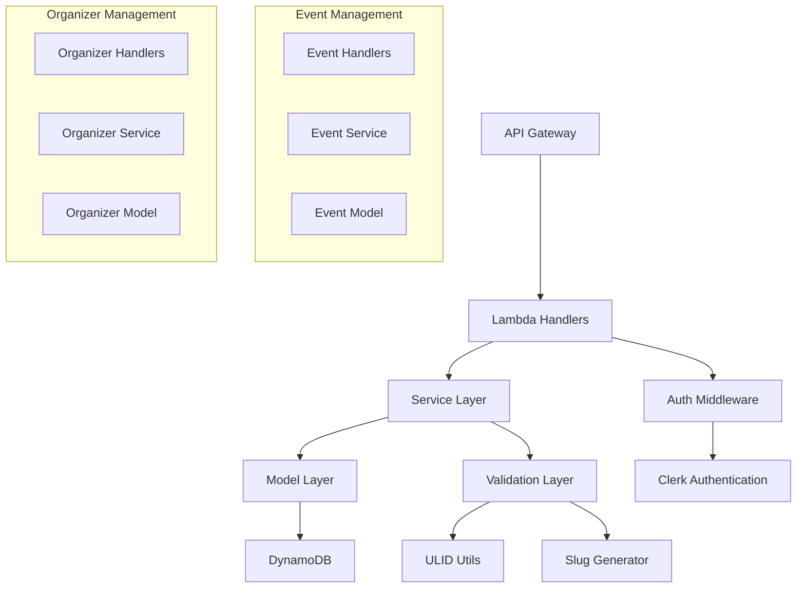

# Design Document

## Overview

The event management system provides comprehensive CRUD operations for events and organizers. The system introduces a separate organizer entity to normalize organizer data and allow reuse across multiple events. The event model will be updated to use ULID-based composite keys for consistency with other models in the system.

Key features:
- Event CRUD operations with ownership validation
- Organizer entity management linked to Clerk authentication
- Team event validation ensuring proper capacity management
- Immutable slug generation for stable event URLs
- Admin override capabilities for all operations

## Architecture

### High-Level Components



### Data Flow

1. **Authentication**: All requests pass through Clerk authentication middleware
2. **Authorization**: Role-based access control (creator, admin)
3. **Validation**: Input validation and business rule enforcement
4. **Service Layer**: Business logic and data orchestration
5. **Model Layer**: ElectroDB entities with DynamoDB operations

## Components and Interfaces

### Event Entity Model

The Event entity will be updated to use ULID-based composite keys and reference organizers by ID. The primary key field remains as `id` to maintain consistency with other models in the system.

```typescript
// Updated Event Entity with ULID-based composite keys
export const EventEntity = new Entity({
  model: {
    entity: 'event',
    version: '1',
    service: 'events',
  },
  attributes: {
    eventId: {
      type: 'string',
      required: true,
      validate: (value: string) => {
        if (!isValidULID(value)) {
          throw new Error('eventId must be a valid ULID format');
        }
        return true;
      }
    },
    creatorId: { type: 'string', required: true }, // Clerk user ID
    organizerId: {
      type: 'string',
      required: true,
      validate: (value: string) => {
        if (!isValidULID(value)) {
          throw new Error('organizerId must be a valid ULID format');
        }
        return true;
      }
    },
    title: { type: 'string', required: true },
    slug: { type: 'string', required: true }, // Immutable after creation
    type: { type: 'string', required: true },
    date: { type: 'string', required: true },
    isFeatured: { type: 'boolean', required: true, default: false },
    isTeamEvent: { type: 'boolean', required: true },
    isRelay: { type: 'boolean', default: false },
    requiredParticipants: { type: 'number', required: true },
    maxParticipants: { type: 'number', required: true },
    currentParticipants: { type: 'number', required: true, default: 0 },
    location: { type: 'string', required: true },
    description: { type: 'string', required: true },
    distance: { type: 'string', required: true },
    registrationFee: { type: 'number', required: true },
    registrationDeadline: { type: 'string', required: true },
    image: { type: 'string', required: true },
    difficulty: { type: 'string', required: true },
    tags: { type: 'list', items: { type: 'string' }, default: [] },
    isEnabled: { type: 'boolean', required: true, default: true },
    createdAt: { type: 'string', required: true },
    updatedAt: { type: 'string', required: true },
    
    // Composite attributes for GSI
    creatorDate: {
      type: 'string',
      required: true,
      watch: ['creatorId', 'date'],
      set: (val, item) => `${item.creatorId}#${item.date}`,
    },
    organizerDate: {
      type: 'string',
      required: true,
      watch: ['organizerId', 'date'],
      set: (val, item) => `${item.organizerId}#${item.date}`,
    },
    typeDate: {
      type: 'string',
      required: true,
      watch: ['type', 'date'],
      set: (val, item) => `${item.type}#${item.date}`,
    },
    difficultyDate: {
      type: 'string',
      required: true,
      watch: ['difficulty', 'date'],
      set: (val, item) => `${item.difficulty}#${item.date}`,
    },
    featuredStatus: {
      type: 'string',
      watch: ['isFeatured'],
      set: (val, { isFeatured }) => isFeatured ? 'featured' : undefined,
    },
    enabledStatus: {
      type: 'string',
      watch: ['isEnabled'],
      set: (val, { isEnabled }) => isEnabled ? 'enabled' : undefined,
    },
  },
  indexes: {
    EventPrimaryIndex: {
      pk: { field: 'id', composite: ['eventId'] },
    },
    CreatorIndex: {
      index: 'CreatorIndex',
      pk: { field: 'creatorId', composite: ['creatorId'] },
      sk: { field: 'creatorDate', composite: ['creatorDate'] },
    },
    OrganizerIndex: {
      index: 'OrganizerIndex',
      pk: { field: 'organizerId', composite: ['organizerId'] },
      sk: { field: 'organizerDate', composite: ['organizerDate'] },
    },
    SlugIndex: {
      index: 'SlugIndex',
      pk: { field: 'slug', composite: ['slug'] },
    },
    TypeIndex: {
      index: 'TypeIndex',
      pk: { field: 'type', composite: ['type'] },
      sk: { field: 'typeDate', composite: ['typeDate'] },
    },
    DifficultyIndex: {
      index: 'DifficultyIndex',
      pk: { field: 'difficulty', composite: ['difficulty'] },
      sk: { field: 'difficultyDate', composite: ['difficultyDate'] },
    },
    FeaturedIndex: {
      index: 'FeaturedIndex',
      pk: { field: 'featuredStatus', composite: ['featuredStatus'] },
      sk: { field: 'date', composite: ['date'] },
    },
    EnabledIndex: {
      index: 'EnabledIndex',
      pk: { field: 'enabledStatus', composite: ['enabledStatus'] },
      sk: { field: 'date', composite: ['date'] },
    },
  },
});
```

### Organizer Entity Model

**Single-Table Design**: Both Event and Organizer entities will use the same DynamoDB table (EVENTS_TABLE_NAME) following the single-table design pattern. ElectroDB will handle entity separation through partition key prefixes automatically:

- Events will have partition keys like `EVENT#<eventId>`
- Organizers will have partition keys like `ORGANIZER#<organizerId>`

This approach:
- Eliminates the need for a new table
- Reduces infrastructure complexity
- Maintains data consistency
- Allows for efficient cross-entity queries when needed

**Reusing Existing GSI**: The existing `CreatorIndex` GSI can be reused for organizer queries since it already indexes by Clerk user ID. No additional GSI is needed because:

- `CreatorIndex` uses `creatorId` as partition key, which stores Clerk user IDs
- Organizers will use `clerkId` field with the same Clerk user ID values
- Both entities can share the same GSI for Clerk-based lookups

This approach:
- Eliminates the need for a new GSI
- Reduces infrastructure complexity and costs
- Leverages existing indexing patterns
- Maintains query performance for both events and organizers

```typescript
export const OrganizerEntity = new Entity({
  model: {
    entity: 'organizer',
    version: '1',
    service: 'events',
  },
  attributes: {
    organizerId: {
      type: 'string',
      required: true,
      validate: (value: string) => {
        if (!isValidULID(value)) {
          throw new Error('organizerId must be a valid ULID format');
        }
        return true;
      }
    },
    clerkId: { type: 'string', required: true }, // Clerk user ID
    name: { type: 'string', required: true },
    contact: { type: 'string', required: true },
    website: { type: 'string' },
    description: { type: 'string' },
    createdAt: { type: 'string', required: true },
    updatedAt: { type: 'string', required: true },
  },
  indexes: {
    OrganizerPrimaryIndex: {
      pk: { field: 'id', composite: ['organizerId'] },
    },
    CreatorIndex: {
      index: 'CreatorIndex',
      pk: { field: 'clerkId', composite: ['clerkId'] },
    },
  },
}, { client: ddbDocClient, table: process.env.EVENTS_TABLE_NAME });
```

### Shared GSI Usage Pattern

Both Event and Organizer entities will use the existing `CreatorIndex` GSI for Clerk-based queries:

```typescript
// Events query by creator (existing pattern)
const userEvents = await EventEntity.query
  .CreatorIndex({ creatorId: clerkUserId })
  .go();

// Organizers query by Clerk ID (new pattern using same GSI)
const userOrganizer = await OrganizerEntity.query
  .CreatorIndex({ clerkId: clerkUserId })
  .go();
```

This shared approach works because:
- Both `creatorId` (events) and `clerkId` (organizers) contain the same Clerk user ID values
- ElectroDB handles entity separation automatically through partition key prefixes
- The GSI can efficiently serve both query patterns

### Service Layer Interfaces

```typescript
// Event Service Interface
export interface EventService {
  createEvent(data: CreateEventData, user: ClerkUser): Promise<EventItem>;
  updateEvent(eventId: string, data: UpdateEventData, user: ClerkUser): Promise<EventItem>;
  deleteEvent(eventId: string, user: ClerkUser): Promise<void>;
  getEvent(eventId: string): Promise<EventItem>;
  getEventBySlug(slug: string): Promise<EventItem>;
  listEventsByCreator(creatorId: string, pagination?: PaginationOptions): Promise<PaginatedEvents>;
  listEventsByOrganizer(organizerId: string, pagination?: PaginationOptions): Promise<PaginatedEvents>;
}

// Organizer Service Interface
export interface OrganizerService {
  createOrganizer(data: CreateOrganizerData, user: ClerkUser): Promise<OrganizerItem>;
  updateOrganizer(organizerId: string, data: UpdateOrganizerData, user: ClerkUser): Promise<OrganizerItem>;
  deleteOrganizer(organizerId: string, user: ClerkUser): Promise<void>;
  getOrganizer(organizerId: string): Promise<OrganizerItem>;
  getOrganizerByClerkId(clerkId: string): Promise<OrganizerItem>;
}
```

### Handler Layer

```typescript
// Event Handlers
export const createEventHandler = withMiddleware(
  withAuth(async (event: AuthenticatedEvent) => {
    const data = JSON.parse(event.body || '{}');
    return await eventService.createEvent(data, event.user);
  }, { requiredRoles: ['organizer', 'admin'] }),
  { cors: { origin: '*' } }
);

export const updateEventHandler = withMiddleware(
  withAuth(async (event: AuthenticatedEvent) => {
    const { eventId } = event.pathParameters || {};
    const data = JSON.parse(event.body || '{}');
    return await eventService.updateEvent(eventId!, data, event.user);
  }, { requiredRoles: ['organizer', 'admin'] }),
  { cors: { origin: '*' } }
);

// Organizer Handlers
export const createOrganizerHandler = withMiddleware(
  withAuth(async (event: AuthenticatedEvent) => {
    const data = JSON.parse(event.body || '{}');
    return await organizerService.createOrganizer(data, event.user);
  }, { requiredRoles: ['organizer', 'admin'] }),
  { cors: { origin: '*' } }
);
```

## Data Models

### Event Data Types

```typescript
export interface EventItem {
  eventId: string;
  creatorId: string;
  organizerId: string;
  title: string;
  slug: string;
  type: string;
  date: string;
  isFeatured: boolean;
  isTeamEvent: boolean;
  isRelay?: boolean;
  requiredParticipants: number;
  maxParticipants: number;
  currentParticipants: number;
  location: string;
  description: string;
  distance: string;
  registrationFee: number;
  registrationDeadline: string;
  image: string;
  difficulty: string;
  tags: string[];
  isEnabled: boolean;
  createdAt: string;
  updatedAt: string;
}

export interface CreateEventData {
  organizerId: string;
  title: string;
  type: string;
  date: string;
  isFeatured?: boolean;
  isTeamEvent: boolean;
  isRelay?: boolean;
  requiredParticipants: number;
  maxParticipants: number;
  location: string;
  description: string;
  distance: string;
  registrationFee: number;
  registrationDeadline: string;
  image: string;
  difficulty: string;
  tags?: string[];
}

export interface UpdateEventData {
  title?: string;
  type?: string;
  date?: string;
  isFeatured?: boolean;
  isTeamEvent?: boolean;
  isRelay?: boolean;
  requiredParticipants?: number;
  maxParticipants?: number;
  location?: string;
  description?: string;
  distance?: string;
  registrationFee?: number;
  registrationDeadline?: string;
  image?: string;
  difficulty?: string;
  tags?: string[];
  isEnabled?: boolean;
}
```

### Organizer Data Types

```typescript
export interface OrganizerItem {
  organizerId: string;
  clerkId: string;
  name: string;
  contact: string;
  website?: string;
  description?: string;
  createdAt: string;
  updatedAt: string;
}

export interface CreateOrganizerData {
  name: string;
  contact: string;
  website?: string;
  description?: string;
}

export interface UpdateOrganizerData {
  name?: string;
  contact?: string;
  website?: string;
  description?: string;
}
```

## Error Handling

### Validation Errors

```typescript
// Team event validation
export const validateTeamEventCapacity = (isTeamEvent: boolean, maxParticipants: number, requiredParticipants: number): void => {
  if (isTeamEvent && maxParticipants % requiredParticipants !== 0) {
    throw new ValidationError(
      'For team events, maxParticipants must be a multiple of requiredParticipants',
      {
        maxParticipants,
        requiredParticipants,
        suggestedMax: Math.floor(maxParticipants / requiredParticipants) * requiredParticipants
      }
    );
  }
};

// Ownership validation
export const validateEventOwnership = (event: EventItem, user: ClerkUser): void => {
  if (user.role !== 'admin' && event.creatorId !== user.id) {
    throw new ForbiddenError('You can only modify events you created');
  }
};

export const validateOrganizerOwnership = (organizer: OrganizerItem, user: ClerkUser): void => {
  if (user.role !== 'admin' && organizer.clerkId !== user.id) {
    throw new ForbiddenError('You can only modify organizers you created');
  }
};
```

### Error Response Patterns

- **400 Bad Request**: Validation errors, malformed data
- **401 Unauthorized**: Missing or invalid authentication
- **403 Forbidden**: Insufficient permissions
- **404 Not Found**: Resource not found
- **409 Conflict**: Resource conflicts (duplicate slug, events with registrations)
- **500 Internal Server Error**: Unexpected system errors

## Infrastructure Changes

### DynamoDB Table Updates

The existing `EventsTable` construct needs to be updated to support the new organizer entity:

1. **Add ClerkIndex GSI** to the `addGlobalSecondaryIndexes()` method
2. **Maintain primary key field** as `id` to stay consistent with existing models
3. **No breaking changes** to existing GSIs - they remain compatible

### Migration Considerations

Since we're keeping the primary key field as `id` but changing the composite key structure:
- Existing event records will need to be migrated to use ULID format
- ElectroDB will handle the composite key generation automatically
- The table structure remains compatible with existing patterns

## Testing Strategy

### Unit Testing

1. **Model Validation Tests**
   - ULID format validation
   - Required field validation
   - Team event capacity validation
   - Composite key generation

2. **Service Layer Tests**
   - Business logic validation
   - Authorization checks
   - Error handling scenarios
   - Data transformation

3. **Handler Tests**
   - Request/response formatting
   - Authentication middleware
   - Error response formatting

### Integration Testing

1. **Database Operations**
   - CRUD operations
   - Index queries
   - Transaction handling

2. **Authentication Flow**
   - Clerk token validation
   - Role-based access control
   - User context propagation

### Business Logic Testing

1. **Team Event Validation**
   - Capacity multiple validation
   - Edge cases (zero participants, large numbers)

2. **Slug Generation**
   - Uniqueness validation
   - Special character handling
   - Collision resolution

3. **Ownership Validation**
   - Creator permissions
   - Admin override scenarios
   - Cross-user access attempts

### Utility Functions

```typescript
// Slug generation utility
export const generateUniqueSlug = async (title: string): Promise<string> => {
  const baseSlug = title
    .toLowerCase()
    .replace(/[^a-z0-9\s-]/g, '')
    .replace(/\s+/g, '-')
    .replace(/-+/g, '-')
    .trim();
  
  let slug = baseSlug;
  let counter = 1;
  
  while (await slugExists(slug)) {
    slug = `${baseSlug}-${counter}`;
    counter++;
  }
  
  return slug;
};

// Event ID generation
export const generateEventId = (): string => {
  return generateULID();
};

// Organizer ID generation
export const generateOrganizerId = (): string => {
  return generateULID();
};
```