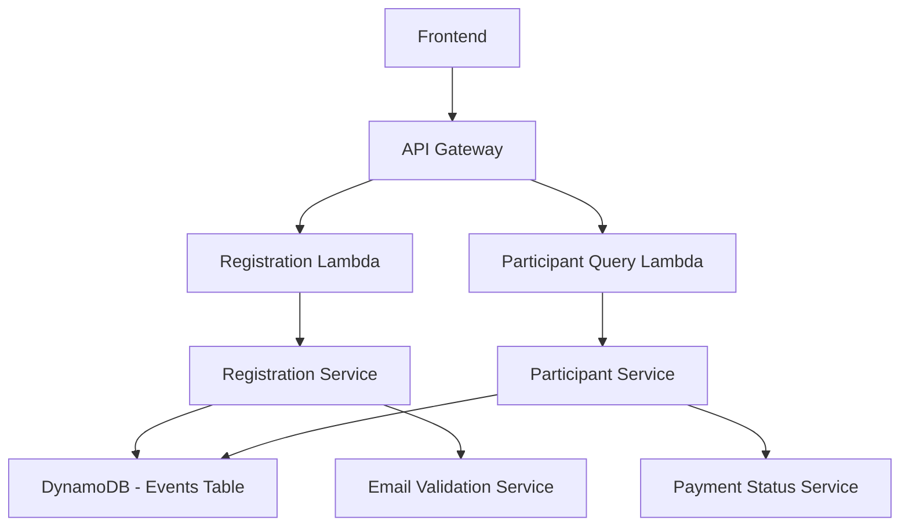

# Event Registration System Design

## Overview

The Event Registration System enables participants to register for triathlon events with support for both individual and team registrations. The system uses DynamoDB for scalable data storage, implements email-based duplicate prevention, and provides reservation ID-based payment tracking. The design leverages the existing ElectroDB pattern and DynamoDB infrastructure while introducing new entities for registration and participant management.

## Architecture

### High-Level Components



### Data Flow

1. **Registration Flow**: Frontend → API → Registration Service → Validation → DynamoDB Storage
2. **Query Flow**: Frontend → API → Participant Service → DynamoDB Query → Response
3. **Payment Update Flow**: Payment System → API → Registration Service → Status Update

## Components and Interfaces

### Core Entities

#### Registration Entity
- **Purpose**: Tracks registration metadata and payment status
- **Primary Key**: reservationId (ULID)
- **Attributes**: eventId, registrationType, paymentStatus, totalParticipants, createdAt, updatedAt

#### Participant Entity  
- **Purpose**: Stores individual participant information
- **Primary Key**: participantId (ULID)
- **Attributes**: reservationId (ULID), eventId, email, personalInfo, emergencyContact, preferences

### ULID Implementation

#### ULID Benefits
- **Sortable**: ULIDs are lexicographically sortable by creation time
- **Compact**: 26 characters vs 36 for UUIDs
- **URL-safe**: Uses Crockford's Base32 encoding
- **Collision-resistant**: 128-bit random component provides strong uniqueness

#### ULID Usage Pattern
```typescript
import { ulid } from 'ulid';

// Generate new IDs
const reservationId = ulid(); // e.g., "01ARZ3NDEKTSV4RRFFQ69G5FAV"
const participantId = ulid(); // e.g., "01ARZ3NDEKTSV4RRFFQ69G5FBW"

// ID validation
const isValidULID = (id: string): boolean => {
  return /^[0123456789ABCDEFGHJKMNPQRSTVWXYZ]{26}$/.test(id);
};
```

#### Entity ID Patterns
- **Registration IDs**: `reservationId = ulid()` - Used for payment tracking and participant grouping
- **Participant IDs**: `participantId = ulid()` - Unique identifier for each individual participant
- **Event IDs**: Existing ULID format maintained for consistency

### Service Layer

#### RegistrationService
```typescript
interface RegistrationService {
  createIndividualRegistration(eventId: string, participantData: IndividualRegistrationData): Promise<RegistrationResult>
  createTeamRegistration(eventId: string, teamData: TeamRegistrationData): Promise<RegistrationResult>
  updatePaymentStatus(reservationId: string, status: PaymentStatus): Promise<void>
  validateRegistrationCapacity(eventId: string, participantCount: number): Promise<boolean>
}
```

#### ParticipantService
```typescript
interface ParticipantService {
  getParticipantsByEvent(eventId: string, organizerId: string): Promise<ParticipantSummary[]>
  getParticipantsByReservation(reservationId: string): Promise<Participant[]>
  validateEmailUniqueness(eventId: string, emails: string[]): Promise<ValidationResult>
}
```

### API Endpoints

#### Registration Endpoints
- `POST /events/{eventId}/registrations` - Create new registration
- `GET /events/{eventId}/registrations` - Get event registrations (organizer only)
- `PATCH /registrations/{reservationId}/payment` - Update payment status

## Data Models

### DynamoDB Table Structure

The system will extend the existing Events table by adding new entity types (registration and participant) while maintaining the current table structure and GSI patterns. This follows DynamoDB single-table design principles and leverages existing infrastructure.

#### Registration Entity Schema
```typescript
{
  // Primary Key with entity prefix for clarity
  id: "REGISTRATION#{reservationId}", // reservationId is ULID
  
  // Entity identification
  entity: "registration",
  
  // Core attributes
  reservationId: string, // ULID format
  eventId: string, // References existing event ULID
  registrationType: "individual" | "team",
  paymentStatus: boolean,
  totalParticipants: number,
  registrationFee: number,
  
  // Timestamps
  createdAt: string,
  updatedAt: string,
  
  // GSI attributes (dedicated fields for new GSIs)
  eventRegistrationId: eventId, // For EventRegistrationIndex
  registrationDate: createdAt,
  eventPaymentStatus: "{eventId}#{paymentStatus}", // For PaymentStatusIndex
  paymentDate: createdAt,
}
```

#### Participant Entity Schema
```typescript
{
  // Primary Key with entity prefix for clarity
  id: "PARTICIPANT#{participantId}", // participantId is ULID
  
  // Entity identification
  entity: "participant",
  
  // Core attributes
  participantId: string, // ULID format
  reservationId: string, // ULID format - references registration
  eventId: string, // References existing event ULID
  email: string,
  
  // Personal information
  firstName: string,
  lastName: string,
  phone?: string,
  dateOfBirth?: string,
  gender?: string,
  
  // Address information
  address?: string,
  city?: string,
  state?: string,
  zipCode?: string,
  country?: string,
  
  // Emergency contact
  emergencyName?: string,
  emergencyRelationship?: string,
  emergencyPhone?: string,
  emergencyEmail?: string,
  
  // Preferences and medical
  shirtSize?: string,
  dietaryRestrictions?: string,
  medicalConditions?: string,
  medications?: string,
  allergies?: string,
  
  // Agreements
  waiver: boolean,
  newsletter: boolean,
  
  // Team-specific
  role?: string, // For team events
  
  // Timestamps
  createdAt: string,
  updatedAt: string,
  
  // GSI attributes (dedicated fields for new GSIs)
  eventParticipantId: eventId, // For EventParticipantIndex
  participantEmail: email,
  reservationParticipantId: reservationId, // For ReservationParticipantIndex
  participantSequence: participantId,
}
```

### Global Secondary Indexes (New GSIs Required)

The registration system requires new GSIs to avoid field overloading and maintain clear data semantics:

#### EventRegistrationIndex (New GSI)
- **PK**: eventRegistrationId (eventId)
- **SK**: registrationDate (createdAt)
- **Purpose**: Query all registrations for an event, sorted by registration time

#### EventParticipantIndex (New GSI)
- **PK**: eventParticipantId (eventId)
- **SK**: participantEmail (email)
- **Purpose**: Query participants by event and validate email uniqueness per event

#### ReservationParticipantIndex (New GSI)
- **PK**: reservationParticipantId (reservationId)
- **SK**: participantSequence (participantId)
- **Purpose**: Query all participants belonging to a specific reservation

#### PaymentStatusIndex (New GSI)
- **PK**: eventPaymentStatus (eventId#paymentStatus)
- **SK**: paymentDate (createdAt)
- **Purpose**: Query paid/unpaid registrations for an event

This approach requires updating the DynamoDB table with new GSIs but provides clean, maintainable data access patterns.

### Impact on Existing Design

**Infrastructure Changes Required**: 
- Need to add 4 new GSIs to the existing events table
- This requires updating the EventsTable construct in CDK
- Existing event functionality remains completely unchanged

**Table Growth**: 
- Registration entities add minimal overhead
- Participant entities scale with event registrations
- DynamoDB auto-scaling handles capacity increases

**Query Isolation**:
- Event queries remain unchanged (entity: "event")
- Registration queries use dedicated GSIs (entity: "registration")
- Participant queries use dedicated GSIs (entity: "participant")
- Entity prefixes in IDs provide clear separation (EVENT#, REGISTRATION#, PARTICIPANT#)

**Benefits of New GSIs**:
- Clean, purpose-built data access patterns
- No field overloading or confusing semantics
- Easy to understand and maintain
- Optimal query performance for each use case

## Error Handling

### Validation Errors
- **DuplicateEmailError**: When email already exists for the event
- **CapacityExceededError**: When event is at maximum capacity
- **InvalidEventError**: When event doesn't exist or is disabled
- **RegistrationClosedError**: When registration deadline has passed

### System Errors
- **DatabaseError**: DynamoDB operation failures
- **ValidationError**: Input data validation failures
- **AuthorizationError**: Unauthorized access to organizer data

### Error Response Format
```typescript
{
  error: {
    code: string,
    message: string,
    details?: any
  }
}
```

## Testing Strategy

### Unit Tests
- **Entity Models**: Test ElectroDB entity definitions and validations
- **Service Layer**: Test business logic with mocked dependencies
- **Validation Logic**: Test email uniqueness and capacity checks
- **Error Handling**: Test all error scenarios and edge cases

### Integration Tests
- **DynamoDB Operations**: Test actual database operations with test data
- **API Endpoints**: Test complete request/response cycles
- **Cross-Entity Operations**: Test registration creation with participant linking

### End-to-End Tests
- **Registration Flows**: Test complete individual and team registration processes
- **Organizer Workflows**: Test participant listing and payment status updates
- **Duplicate Prevention**: Test email uniqueness across various scenarios

### Test Data Management
- Use separate DynamoDB table for testing
- Implement test data cleanup utilities
- Create test fixtures for common scenarios

## Security Considerations

### Data Protection
- Encrypt sensitive participant data at rest
- Implement field-level access controls for medical information
- Audit logging for data access and modifications

### Access Control
- Organizers can only access their own event registrations
- Participants can only access their own registration data
- Admin users have full system access

### Input Validation
- Sanitize all input data to prevent injection attacks
- Validate email formats and required fields
- Implement rate limiting for registration endpoints

## Performance Considerations

### DynamoDB Optimization
- Use batch operations for team registrations
- Implement efficient GSI queries for participant lookups
- Consider read/write capacity planning for registration rushes

### Caching Strategy
- Cache event details to reduce database calls
- Implement participant count caching with TTL
- Use API Gateway caching for organizer queries

### Scalability
- Design for concurrent registrations during popular events
- Implement optimistic locking for capacity management
- Use DynamoDB auto-scaling for traffic spikes