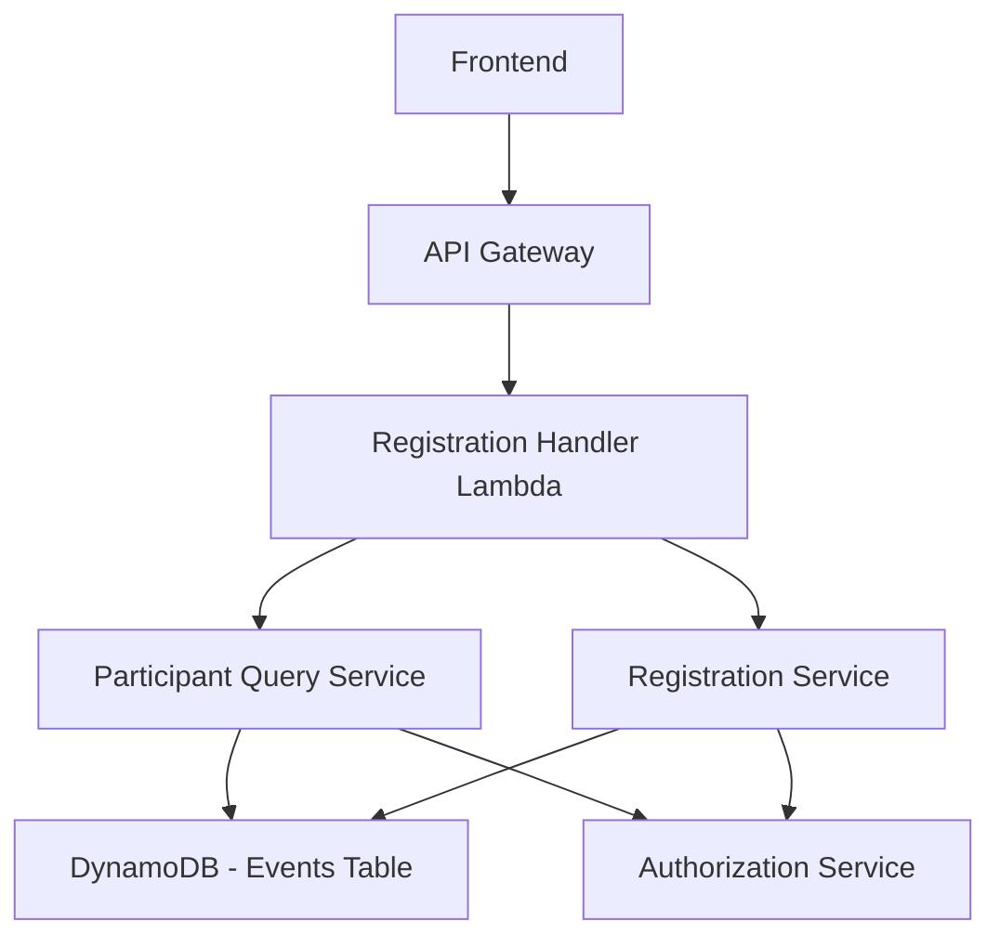

# RSVP Management System Design

## Overview

The RSVP Management System provides endpoints for event organizers to retrieve and delete specific event registrations by reservation ID. The system builds on the existing event registration infrastructure, leveraging the same DynamoDB table structure and ElectroDB patterns while adding new service methods and API endpoints for RSVP management operations.

## Architecture

### High-Level Components



### Data Flow

1. **RSVP Retrieval Flow**: Frontend → API → Registration Handler → Participant Query Service → Authorization Check → DynamoDB Query → Response
2. **RSVP Deletion Flow**: Frontend → API → Registration Handler → Registration Service → Authorization Check → Atomic Deletion → Event Count Update → Response

## Components and Interfaces

### Service Layer Extensions

#### ParticipantService (Extended)
```typescript
interface ParticipantService {
  // Existing methods
  getParticipantsByEvent(eventId: string, organizerId: string): Promise<ParticipantSummary[]>
  getParticipantsByReservation(reservationId: string): Promise<Participant[]>
  validateEmailUniqueness(eventId: string, emails: string[]): Promise<ValidationResult>
  
  // New methods for RSVP management
  getRegistrationWithParticipants(reservationId: string, organizerId: string): Promise<RegistrationWithParticipants>
  validateReservationAccess(reservationId: string, organizerId: string): Promise<boolean>
}
```

#### RegistrationService (Extended)
```typescript
interface RegistrationService {
  // Existing methods
  createIndividualRegistration(eventId: string, participantData: IndividualRegistrationData): Promise<RegistrationResult>
  createTeamRegistration(eventId: string, teamData: TeamRegistrationData): Promise<RegistrationResult>
  updatePaymentStatus(reservationId: string, status: PaymentStatus): Promise<void>
  validateRegistrationCapacity(eventId: string, participantCount: number): Promise<boolean>
  
  // New methods for RSVP management
  deleteRegistrationByReservationId(reservationId: string, organizerId: string): Promise<DeletionResult>
  validateDeletionPermissions(reservationId: string, organizerId: string): Promise<ValidationResult>
  performAtomicDeletion(reservationId: string): Promise<void>
}
```

### API Endpoints

#### RSVP Management Endpoints (Added to existing registration handlers)
- `GET /registrations/{reservationId}` - Get registration by reservation ID (organizer only)
- `DELETE /registrations/{reservationId}` - Delete registration by reservation ID (organizer only)

These endpoints will be added to the existing registration API handlers, leveraging the current infrastructure and service patterns.

## Data Models

### Response Models

#### RegistrationWithParticipants
```typescript
interface RegistrationWithParticipants {
  registration: {
    reservationId: string;
    eventId: string;
    registrationType: 'individual' | 'team';
    paymentStatus: boolean;
    totalParticipants: number;
    registrationFee: number;
    createdAt: string;
    updatedAt: string;
  };
  participants: Participant[];
  event: {
    id: string;
    title: string;
    creatorId: string;
  };
}
```

#### DeletionResult
```typescript
interface DeletionResult {
  success: boolean;
  reservationId: string;
  deletedParticipantCount: number;
  eventId: string;
  message: string;
}
```

### Database Access Patterns

#### Get Registration by Reservation ID (Using ElectroDB)
1. **Primary Query**: `RegistrationEntity.get({ reservationId }).go()`
2. **Participant Query**: `ParticipantEntity.query.ReservationParticipantIndex({ reservationParticipantId: reservationId }).go()`
3. **Event Query**: `EventEntity.get({ id: eventId }).go()` for authorization

#### Delete Registration by Reservation ID (Using ElectroDB)
1. **Authorization Check**: Verify organizer owns the event using ElectroDB queries
2. **Participant Retrieval**: Get all participants using ReservationParticipantIndex
3. **Atomic Deletion**: Use ElectroDB entity delete operations in DynamoDB transaction
4. **Event Update**: Use ElectroDB entity update operation to decrement participant count

### Data Consistency Strategy

#### Atomic Deletion Process (Using ElectroDB patterns with logging)
```typescript
// Integration into existing RegistrationService
async deleteRegistrationByReservationId(reservationId: string, organizerId: string): Promise<DeletionResult> {
  logger.info('Starting registration deletion process', {
    reservationId,
    organizerId,
    operation: 'deleteRegistrationByReservationId'
  });
  
  try {
    // 1. Validate permissions using existing authorization patterns
    const registration = await this.paymentStatusService.getRegistrationByReservationId(reservationId);
    if (!registration) {
      logger.warn('Registration not found for deletion', { reservationId, organizerId });
      throw new NotFoundError('Registration not found');
    }
    
    logger.debug('Registration found for deletion', {
      reservationId,
      eventId: registration.eventId,
      registrationType: registration.registrationType,
      totalParticipants: registration.totalParticipants,
      paymentStatus: registration.paymentStatus
    });
    
    const event = await this.eventService.getEventById(registration.eventId);
    if (!event) {
      logger.error('Associated event not found for deletion', {
        reservationId,
        eventId: registration.eventId,
        organizerId
      });
      throw new NotFoundError('Associated event not found');
    }
    
    if (event.creatorId !== organizerId) {
      logger.warn('Unauthorized deletion attempt', {
        reservationId,
        eventId: registration.eventId,
        organizerId,
        eventCreatorId: event.creatorId
      });
      throw new AuthorizationError('Unauthorized access to registration');
    }
    
    // 2. Get all participants using existing service
    const participants = await this.participantService.getParticipantsByReservation(reservationId);
    
    logger.info('Preparing atomic deletion transaction', {
      reservationId,
      eventId: registration.eventId,
      participantCount: participants.length,
      participantIds: participants.map(p => p.participantId)
    });
    
    // 3. Perform atomic deletion using ElectroDB entity operations
    const transactionItems = [];
    
    // Add participant deletions using ElectroDB delete operations
    participants.forEach(participant => {
      const deleteParams = ParticipantEntity.delete({ participantId: participant.participantId }).params();
      transactionItems.push({
        Delete: deleteParams
      });
    });
    
    // Add registration deletion using ElectroDB delete operation
    const registrationDeleteParams = RegistrationEntity.delete({ reservationId }).params();
    transactionItems.push({
      Delete: registrationDeleteParams
    });
    
    // Add event count update using ElectroDB update operation
    const eventUpdateParams = EventEntity.update({ id: registration.eventId })
      .add({ currentParticipants: -participants.length })
      .params();
    transactionItems.push({
      Update: eventUpdateParams
    });
    
    logger.debug('Executing atomic deletion transaction', {
      reservationId,
      transactionItemCount: transactionItems.length,
      participantCountDecrement: -participants.length
    });
    
    // Execute transaction using ElectroDB's transaction support
    await this.dynamodb.transactWrite({ TransactItems: transactionItems }).promise();
    
    logger.info('Registration deletion completed successfully', {
      reservationId,
      eventId: registration.eventId,
      deletedParticipantCount: participants.length,
      organizerId
    });
    
    return {
      success: true,
      reservationId,
      deletedParticipantCount: participants.length,
      eventId: registration.eventId,
      message: 'Registration and all participants deleted successfully'
    };
  } catch (error) {
    logger.error('Error during registration deletion', {
      reservationId,
      organizerId,
      error: error.message,
      stack: error.stack
    });
    throw error;
  }
}
```

## Error Handling

### Error Types

#### NotFoundError
```typescript
class NotFoundError extends Error {
  constructor(message: string, details?: any) {
    super(message);
    this.name = 'NotFoundError';
    this.details = details;
  }
}
```

#### AuthorizationError
```typescript
class AuthorizationError extends Error {
  constructor(message: string, details?: any) {
    super(message);
    this.name = 'AuthorizationError';
    this.details = details;
  }
}
```

#### ValidationError
```typescript
class ValidationError extends Error {
  constructor(message: string, details?: any) {
    super(message);
    this.name = 'ValidationError';
    this.details = details;
  }
}
```

### Error Response Mapping

```typescript
const errorResponseMap = {
  NotFoundError: { statusCode: 404, code: 'REGISTRATION_NOT_FOUND' },
  AuthorizationError: { statusCode: 403, code: 'UNAUTHORIZED_ACCESS' },
  ValidationError: { statusCode: 400, code: 'INVALID_REQUEST' },
  DatabaseError: { statusCode: 500, code: 'INTERNAL_SERVER_ERROR' }
};
```

### Error Response Format
```typescript
{
  error: {
    code: string,
    message: string,
    details?: {
      reservationId?: string,
      field?: string,
      value?: string
    }
  }
}
```

## Authorization Strategy

### Organizer Access Control

#### Access Validation Flow
1. **Extract User ID**: Get organizer ID from authentication context
2. **Retrieve Registration**: Get registration record by reservation ID
3. **Get Event Details**: Retrieve event information using event ID from registration
4. **Verify Ownership**: Confirm that organizer ID matches event creator ID
5. **Grant/Deny Access**: Allow operation if ownership is verified

#### Authorization Integration (Using ElectroDB patterns with logging)
The authorization logic will be integrated into the existing service methods, using proper ElectroDB entity operations and comprehensive logging:

```typescript
// Integration into existing ParticipantService
async getRegistrationWithParticipants(reservationId: string, organizerId: string): Promise<RegistrationWithParticipants> {
  logger.info('Retrieving registration with participants', {
    reservationId,
    organizerId,
    operation: 'getRegistrationWithParticipants'
  });
  
  try {
    // Get registration using ElectroDB entity
    const registrationResult = await RegistrationEntity.get({ reservationId }).go();
    if (!registrationResult.data) {
      logger.warn('Registration not found', { reservationId, organizerId });
      throw new NotFoundError('Registration not found');
    }
    const registration = registrationResult.data;
    
    logger.debug('Registration found', {
      reservationId,
      eventId: registration.eventId,
      registrationType: registration.registrationType,
      totalParticipants: registration.totalParticipants
    });
    
    // Get event using ElectroDB entity to check creator
    const eventResult = await EventEntity.get({ id: registration.eventId }).go();
    if (!eventResult.data) {
      logger.error('Associated event not found', {
        reservationId,
        eventId: registration.eventId,
        organizerId
      });
      throw new NotFoundError('Associated event not found');
    }
    
    if (eventResult.data.creatorId !== organizerId) {
      logger.warn('Unauthorized access attempt to registration', {
        reservationId,
        eventId: registration.eventId,
        organizerId,
        eventCreatorId: eventResult.data.creatorId
      });
      throw new AuthorizationError('Unauthorized access to registration');
    }
    
    const event = eventResult.data;
    
    // Get participants using ElectroDB ReservationParticipantIndex
    const participantsResult = await ParticipantEntity.query
      .ReservationParticipantIndex({ reservationParticipantId: reservationId })
      .go();
    const participants = participantsResult.data;
    
    logger.info('Successfully retrieved registration with participants', {
      reservationId,
      eventId: registration.eventId,
      participantCount: participants.length,
      organizerId
    });
    
    return { registration, participants, event };
  } catch (error) {
    logger.error('Error retrieving registration with participants', {
      reservationId,
      organizerId,
      error: error.message,
      stack: error.stack
    });
    throw error;
  }
}
```

## Performance Considerations

### Query Optimization

#### Single-Request Data Retrieval
- Use batch operations to retrieve registration and participants in minimal requests
- Leverage GSI queries for efficient participant lookups by reservation ID
- Cache event details to reduce repeated queries during authorization

#### Deletion Optimization
- Use DynamoDB transactions for atomic deletion operations
- Batch participant deletions to minimize transaction items
- Implement optimistic concurrency control for event count updates

### Caching Strategy

#### Registration Data Caching
- Cache frequently accessed registration data with short TTL (5 minutes)
- Cache event ownership information for authorization checks
- Implement cache invalidation on registration modifications

## Security Considerations

### Input Validation

#### ULID Validation
```typescript
const ULID_REGEX = /^[0123456789ABCDEFGHJKMNPQRSTVWXYZ]{26}$/;

function validateULID(id: string, fieldName: string): void {
  if (!ULID_REGEX.test(id)) {
    throw new ValidationError(`Invalid ${fieldName} format`, { field: fieldName, value: id });
  }
}
```

#### Request Sanitization
- Validate all input parameters against expected formats
- Sanitize reservation IDs to prevent injection attacks
- Implement rate limiting for deletion operations

### Data Protection
- Log all deletion operations for audit trails
- Implement soft deletion option for compliance requirements
- Encrypt sensitive participant data in transit and at rest

### Access Control
- Enforce strict organizer-only access to RSVP operations
- Implement request signing for API authentication
- Add IP-based access controls for sensitive operations

## Testing Strategy

### Unit Tests

#### Service Layer Testing
- Test RSVP query service with various reservation ID scenarios
- Test deletion service with atomic transaction validation
- Test authorization service with different ownership scenarios
- Test error handling for all failure cases

#### Validation Testing
- Test ULID format validation with valid and invalid inputs
- Test authorization logic with different user roles
- Test data consistency during concurrent operations

### Integration Tests

#### Database Operations
- Test registration retrieval with real DynamoDB operations
- Test atomic deletion transactions with rollback scenarios
- Test event count updates during deletion operations

#### API Endpoint Testing
- Test complete request/response cycles for both endpoints
- Test error responses for various failure scenarios
- Test authorization enforcement across different user contexts

### End-to-End Tests

#### RSVP Management Workflows
- Test complete registration retrieval flow from API to response
- Test complete deletion flow including event count updates
- Test concurrent deletion attempts and race condition handling

#### Error Scenario Testing
- Test behavior when registration doesn't exist
- Test behavior when organizer lacks permissions
- Test behavior during database failures and partial operations

## Monitoring and Observability

### Logging Strategy

#### Structured Logging Format
All logs will use structured JSON format with consistent fields:
```typescript
interface RSVPLogContext {
  reservationId: string;
  organizerId: string;
  operation: 'getRegistrationWithParticipants' | 'deleteRegistrationByReservationId';
  eventId?: string;
  participantCount?: number;
  registrationType?: 'individual' | 'team';
  paymentStatus?: boolean;
  error?: string;
  stack?: string;
  duration?: number;
}
```

#### Log Levels and Events
- **INFO**: Operation start/completion, successful retrievals and deletions
- **DEBUG**: Detailed operation steps, transaction preparation, participant details
- **WARN**: Authorization failures, not found scenarios, invalid requests
- **ERROR**: Database errors, transaction failures, unexpected exceptions

#### Key Logging Points
1. **Operation Start**: Log operation initiation with context
2. **Authorization Checks**: Log access validation results
3. **Data Retrieval**: Log successful data fetching with counts
4. **Transaction Preparation**: Log atomic operation setup
5. **Transaction Execution**: Log transaction success/failure
6. **Operation Completion**: Log final results with metrics

### Metrics Collection
- **Request Metrics**: Count and latency for GET/DELETE operations
- **Authorization Metrics**: Success/failure rates for access checks
- **Deletion Metrics**: Participant counts, transaction success rates
- **Error Metrics**: Error types and frequencies by operation

### Alerting
- **High Error Rates**: Alert when RSVP operation error rate exceeds 5%
- **Authorization Failures**: Alert on repeated unauthorized access attempts
- **Transaction Failures**: Alert on DynamoDB transaction failures
- **Performance Degradation**: Alert when operation latency exceeds thresholds